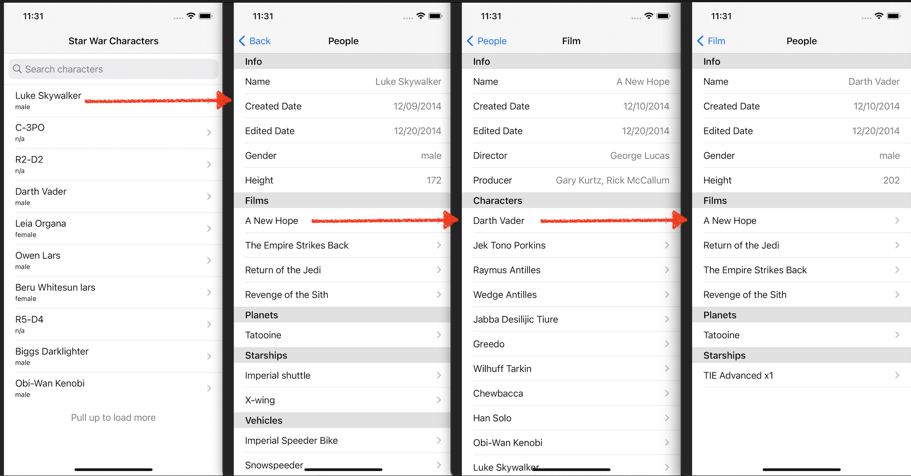

# Star War API

* XCode: 12.4
* iOS: 14.4
* target: Star War API

## Screenshots

## Network 
* APIClient
	* fetch one or more resources with url(s)

## Extensions
* DateFormatter+Extensions
	* declare iso8601 with milliseconds format
* Date+Extensions
	* date's string getter
* UIViewController+Extensions
	* show and hide `SpinnerViewController`
	* show alert view

## Data Model Protocols
DataModelProtocol

## Data Models
* SearchResult
	* parse and store `People` search results
* SectionData
	* store section data for `DetailTableViewController`
	* store an array of `RowData`
* RowData
	* store row data for `DetailTableViewController`
* Resource data models: conform to `DataModelProtocol` and parse resource responses
	* People
	* Film
	* Species
	* Starship
	* Vehicle
	* Planet

## View Models
* MasterViewModel
	* store and provide data to display in `MasterViewController``
	* provide url for People search request
	
* DetailViewModel
	* process resource data
		* fetch resources
		* convert resource data to `SectionData` and `RowData`, sections
		* filter and sort section`
	* provide data to display in `DetailTableViewController`

## View Controllers
* MasterViewController
	* display `People` and search `People` by name
	* pull up to load more `People`
	* perform search when user stops typing for n seconds (default is 0.5 seconds)
	* show messages for no results found and being able to load more People
* DetailTableViewController
	* display resource info and additional resources
	* navigate between resources
	* wait for all requests to return before showing all additional resources
* SpinnerViewController
	* display activity indicator in full view
	* block user interaction to view controller's view while showing