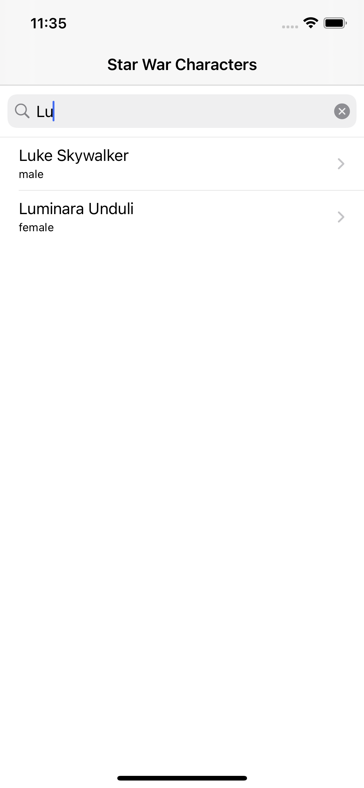

# Star War API

* XCode: 12.4
* iOS: 14.4
* target: Star War API

## Screenshots

## Network 
* APIClient

## Data Model Protocols
DataModelProtocol

## Data Models
* SearchResult
* SectionData: stores section data in DetailTableViewController
* RowData: stores row data in DetailTableViewController
* People (conforms to DataModelProtocol)
* Film (conforms to DataModelProtocol)
* Species (conforms to DataModelProtocol)
* Starship (conforms to DataModelProtocol)
* Vehicle (conforms to DataModelProtocol)
* Planet (conforms to DataModelProtocol)

## View Models
* MasterViewModel
* DetailViewModel

## View Controllers
* MasterViewController
* DetailTableViewController
* SpinnerViewController

### Master View Controller
Display people and search people by name

### Detail View Controller
Display resource details and additional resources

### SpinnerViewController
Display activity indicator in full view